# 2D Gaussian Quadrature
00957016 高敬庭
## Result
+ Exact value = 470.327210063638  
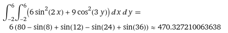  
+ 1x1 with different sample points  
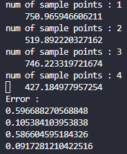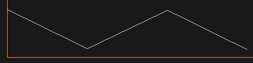  
+ 2x2 with different sample points  
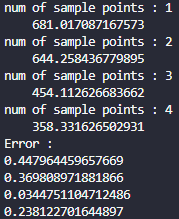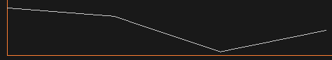  
+ 4x4 with different sample points  
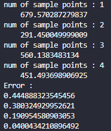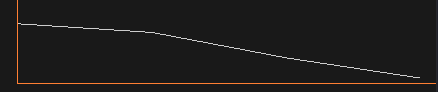  
+ 8x8 with different sample points  
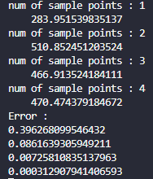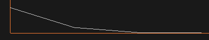  
根據上述結果可以看到在domain相同的情況下，增加sample point是可以提高精準度，但是同樣數量的sample point，將domain分的更細則不一定會更準確，少部分情況反而會比前一次誤差更大。  
  
根據以上結論再測試  
+ sample point = 2, mesh 從 1x1 ~ 8x8  
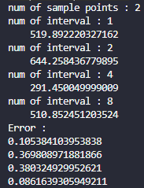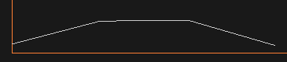  
+ sample point = 4, mesh 從 1x1 ~ 8x8  
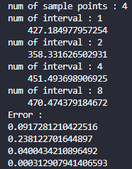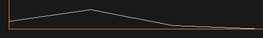  
可以看到細分domain不一定會更準，但是夠多的sample point和足夠細的domain可以求出精準的結果。